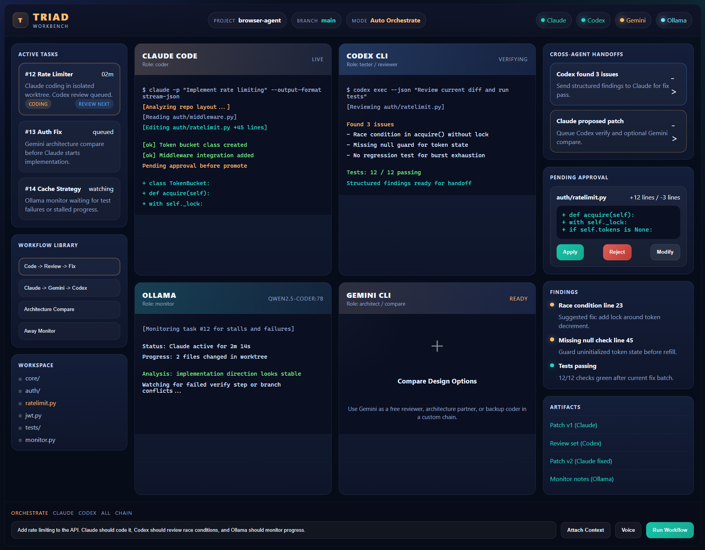

# Triad Workbench

Local-first, CLI-native multi-agent coding workbench for:

- Claude Code
- Codex CLI
- Gemini CLI
- Ollama

Triad Workbench is an Electron desktop app for running coding agents safely in one place. It uses isolated git worktrees, a review-first workflow, and a per-project archive so you can inspect what each agent actually did before promoting changes back to your main checkout.



## Why This Project Exists

Most AI coding setups break down in the same places:

- too many tabs and terminals
- unclear separation between coding and review
- agents writing directly into the main checkout
- no durable record of prompts, logs, patches, or findings

Triad Workbench is designed to fix that with a local mission-control workflow:

1. Open a real git project
2. Connect the agents you want to use
3. Run a built-in workflow inside an isolated worktree
4. Review findings, logs, and diffs
5. Explicitly promote the result

## Core Features

- Electron + React desktop shell
- Agent grid for Claude, Codex, Gemini, and Ollama
- Windows and WSL runner support
- In-app agent probing and onboarding states
- Interactive terminals for CLI agents
- Built-in multi-agent workflows
- Isolated git worktree per task
- SQLite persistence for projects, tasks, artifacts, and profiles
- Per-project `.triad-workbench` archive for prompts, logs, diffs, transcripts, and snapshots
- Review center with findings, artifacts, diffs, and promotion actions

## Built-In Workflows

- `Code -> Review -> Fix -> Verify`
  - Claude writes
  - Codex reviews
  - Claude fixes
  - Codex verifies
- `Code -> Gemini Compare -> Codex Review`
  - Claude writes
  - Gemini critiques
  - Codex reviews
- `Architecture Compare`
  - Compare architecture suggestions from Claude, Codex, Gemini, and Ollama
- `Away Monitor`
  - Use Ollama as a local monitor for longer-running work

## How It Works

### Main Safety Model

- Every task gets its own git worktree
- Agent changes stay inside that worktree
- Review happens before promotion
- `Apply to main` is an explicit user action

### Agent Roles

- `Claude Code`
  - main coder and fix pass
- `Codex CLI`
  - reviewer and verifier
- `Gemini CLI`
  - architecture / critique / compare support
- `Ollama`
  - local guide / tester / developer / monitor support

### Archive Model

Each project can save runtime evidence into:

```text
<project>/.triad-workbench
```

That archive can contain:

- snapshots
- task JSON
- artifact JSON
- prompts
- stdout / stderr logs
- diffs
- terminal transcripts
- event timelines

## Getting Started

### Prerequisites

Install these locally on the machine or selected runner:

- `claude`
- `codex`
- `gemini`
- optionally `ollama`

### Development

```powershell
npm install
npm run dev
```

### Validation

```powershell
npm run typecheck
npm test
npm run build
```

## Using Triad On An Existing Project

1. Open a real git repository with `Open project`
2. Set the correct runner: `Windows`, `WSL`, or `Auto`
3. Click `Probe agents`
4. Connect any missing or logged-out agents
5. Choose a workflow
6. Write a small task brief
7. Click `Run workflow`
8. Review the results
9. Choose:
   - `Apply to main`
   - `Keep worktree`
   - `Open task branch`

## Starting A New Project From Scratch

Create a small git-backed project before using Triad:

```powershell
mkdir my-small-app
cd my-small-app
git init
npm init -y
git add .
git commit -m "Initial scaffold"
```

Then:

1. Open that folder in Triad
2. Connect Claude and Codex first
3. Use `Code -> Review -> Fix -> Verify`
4. Start with a very small brief

Example:

```text
Create a TypeScript CLI todo app with add, list, and done commands.
Store data in a local JSON file.
Add Vitest tests for the main flows.
Keep the implementation simple and readable.
```

## Repository Guides

- [TRIAD_WORKBENCH_AI_CONTEXT.md](./TRIAD_WORKBENCH_AI_CONTEXT.md)
- [TRIAD_WORKBENCH_BUILD_GUIDE.md](./TRIAD_WORKBENCH_BUILD_GUIDE.md)
- [TRIAD_WORKBENCH_SOURCE_REFERENCE.md](./TRIAD_WORKBENCH_SOURCE_REFERENCE.md)
- [docs/USER_GUIDE.md](./docs/USER_GUIDE.md)
- [docs/slides/triad-workbench-user-guide.pptx](./docs/slides/triad-workbench-user-guide.pptx)
- [docs/slides/triad-workbench-client-demo.pptx](./docs/slides/triad-workbench-client-demo.pptx)
- [docs/slides/triad-workbench-beginner-5-slide.pptx](./docs/slides/triad-workbench-beginner-5-slide.pptx)
- [docs/slides/triad-workbench-team-training.pptx](./docs/slides/triad-workbench-team-training.pptx)

## Planning And Project Structure

- `.planning/`
  - canonical planning docs tracked in git
- `.triad-workbench/`
  - per-project runtime archive storage
- `docs/superpowers/plans/`
  - human-readable mirror of planning docs

Useful scripts:

- `npm run planning:check`
- `npm run planning:sync`

## Tech Stack

- Electron 37
- React 19
- Vite / electron-vite
- TypeScript 5
- Zustand
- better-sqlite3
- node-pty
- xterm.js

## Current Scope

Triad Workbench is already a working scaffold, but it is still evolving. It is best suited today for:

- small to medium coding tasks
- safe review-driven development
- comparing multiple coding agents
- keeping an evidence trail of AI work

It is not yet intended to be:

- a full per-agent chat product
- a one-shot giant app generator
- a no-review auto-merge workflow

## Contributing

Please read:

- [CONTRIBUTING.md](./CONTRIBUTING.md)
- [SECURITY.md](./SECURITY.md)
- [CODE_OF_CONDUCT.md](./CODE_OF_CONDUCT.md)

## License

This project is licensed under the [MIT License](./LICENSE).
